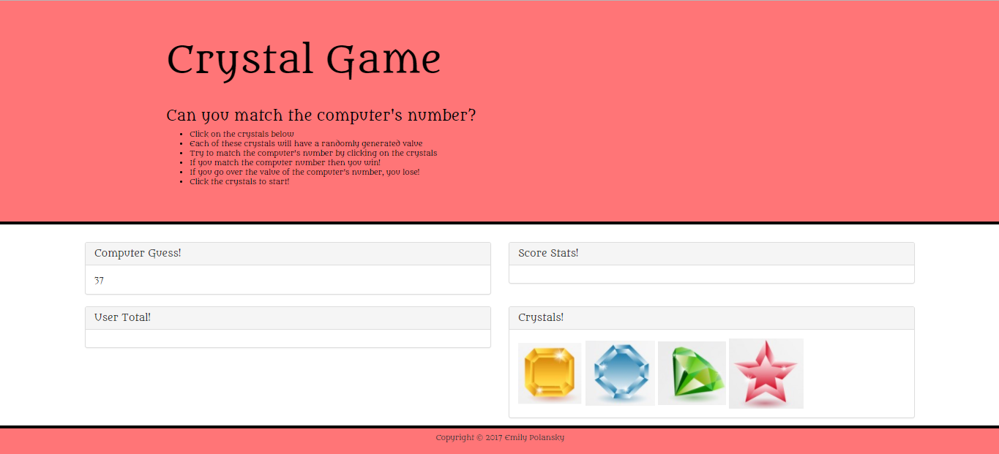

# Crystal Game

Each of these crystals has a randomly generated value. 

The user must try to match the computer's number by clicking on the crystals.

The computer's number and the values of the crystals are randomly generated and change ever game.

If the user can match the computer's number then they win!

If the user goes over the value of the computer's number, then they lose!

The user must click on one of the four crystals to start.

## Languages and Packages Used

This application uses HTML, CSS, Bootstrap, JavaScript, and JQuery.